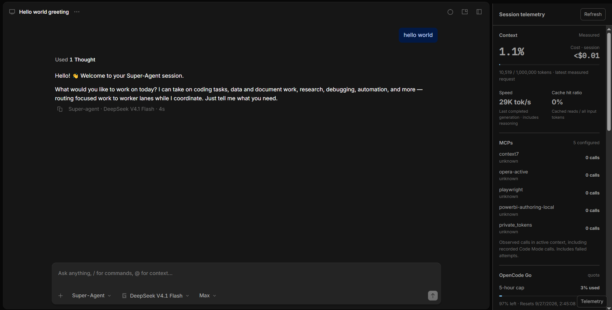
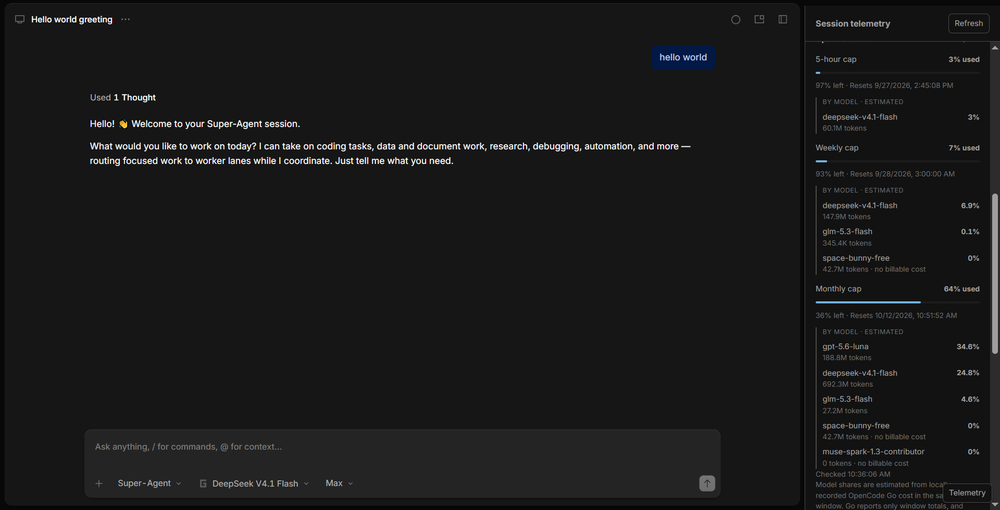
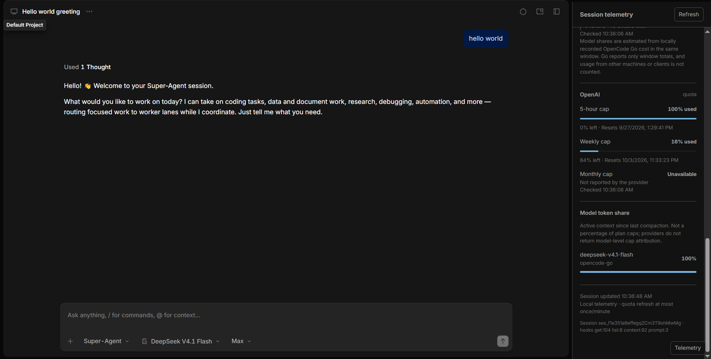

# OpenCode Session Telemetry Sidebar

A right-hand sidebar for the **OpenCode desktop app** showing live session telemetry:

- **Context** window usage, in tokens and percent
- **Cost** for the session, matching OpenCode's own readout
- **Speed** in tokens/second (`32.5K tok/s`, `1.2M tok/s`)
- **Cache hit ratio**
- **MCP servers** and how many calls each one served
- **OpenCode Go and OpenAI subscription caps** — 5-hour, weekly and monthly, as used/remaining percent with reset times
- **Estimated per-model share** of each OpenCode Go cap window
- **Model token share** inside the active context
- **History search** — a Search button beside Telemetry that finds text in every session
  (user prompts and agent replies) and opens any hit as an additional session tab







---

## Search

The **Search** button next to **Telemetry** searches the text of every session in your local
database — user prompts and agent replies, never reasoning or tool calls. Each hit shows the
session title, folder, time and a highlighted snippet; clicking it opens that session as a new
tab, leaving your currently open sessions untouched.

- An empty query lists the most recent messages.
- **User** / **Agent** toggle which roles are searched (both are on by default).
- The dropdown sets results per page (20–100); numbered pages and next/previous controls reach
  later matches without loading the entire database up front.
- Typing again aborts the previous search; a term that matches nothing is bounded by an
  8-second budget, and the panel says so when older history was not fully scanned.
- Hover a result for a wider context window. Nothing is written to the database.

Search reads the current V2 store (`session_v2` / `session_message`) read-only, with whichever
SQLite driver the server ships. It needs the server half of this project, so an install that
predates 1.1.0 answers `Search failed.` until OpenCode is restarted after the update.

---

## Requirements

| | |
|---|---|
| OS | Windows 10/11 |
| App | OpenCode **desktop** app, 2.x (`@opencode/desktop`) |
| Python | 3.8 or newer, available as `py` on PATH |

Check Python with:

```cmd
py --version
```

## Install

1. **Quit OpenCode completely** — close every window and the tray icon. The installer
   refuses to run while it is open, and will not modify anything.
2. Double-click **`Install-Sidebar.cmd`**.
3. Start OpenCode and open any session.

You should see a **Telemetry** button at the bottom-right, with a **Search** button next to it.
The sidebar is open by default; click the button (or press `Escape` while it has focus) to
collapse it.

Running the installer again **upgrades both halves in place**: the archive is rebuilt from the
pristine backup, and the server plugin files are updated (files a previous install wrote are
recognised, so nothing needs to be deleted first).

To check compatibility before installing anything, run **`Verify-Compatibility.cmd`**.

Prefer a guided document? **`Instructions.docx`** in this folder walks through the same
steps with screenshots of what the finished sidebar looks like.

Stuck on a failure, or want an AI agent to fix it? Hand it **`AI Assitance.md`**. It documents
the architecture, the install pipeline, and a symptom-by-symptom diagnostic ladder.

## Uninstall

1. **Quit OpenCode completely.**
2. Double-click **`Rollback-Sidebar.cmd`**.

The original app archive is restored and the telemetry plugin is moved into `backups/`
rather than deleted, so nothing is lost.

---

## How it works

OpenCode's desktop UI is an Electron app whose renderer ships as a bundled `app.asar`.
This project makes two changes, both reversible:

1. **A small patch inside the archive.** A wrapper is inserted around the function that
   creates the API client, plus three ES modules are added next to the app bundle. The
   wrapper lets the sidebar observe the client the app already uses. Every other byte of
   the archive is preserved, and this is verified file-by-file during staging.

2. **One server plugin** at `~/.config/opencode/plugins/local-telemetry/`. It reads your
   OpenCode Go and OpenAI credentials *inside the OpenCode server process*, calls each
   provider's own usage endpoint, and returns **only percentages and reset times** over a
   local RPC. Credentials never reach the UI, and are never written to disk by this project.
   The same plugin answers the sidebar's history search: it opens the local SQLite database
   read-only and returns matched message text and location fields. It never writes.

The patcher is **not tied to one app version**: it discovers the renderer bundle and the
client factory by shape, so a renamed function or a new bundle hash still works. It is last
verified against `@opencode/desktop` **2.0.18**.

### Where each number comes from

| Shown | Source | Accuracy |
|---|---|---|
| Context, tokens, speed, cache ratio | messages in the session | measured |
| Session cost | the session itself | as reported by OpenCode |
| MCP calls | tool calls in the active context | observed |
| Model token share | tokens per model in the active context | measured |
| Go / OpenAI window totals | each provider's usage API | provider-reported |
| Per-model share of a Go cap | provider total × local cost share | **estimated** |

Everything is computed locally from your own machine. Nothing is uploaded anywhere;
the only outbound requests are to the two provider usage endpoints.

---

## Honest limitations

These are worth reading before you rely on a number.

**The per-model share of the OpenCode Go caps is an estimate.** The Go usage API reports
only a window total (for example "64% used"); it does not attribute usage to models. The
split shown is that total distributed by each Go model's share of *locally recorded* cost
in the same window. It is labelled `BY MODEL · ESTIMATED` in the UI for that reason.

Three consequences:

- Only usage recorded by **this** OpenCode installation is visible. Usage in the Go web
  console, another machine, or another client will not appear, so shares can be too low.
- Free models show `0%` because they carry no billable cost. If Go's cap counts them, that
  share is missing.
- Provider percentages are whole numbers, so the window total is itself rounded. A split of
  a small window (say 3%) is precise to roughly ±1 percentage point.

**Other providers do not get cap sections automatically.** Adding an API key for a new
provider makes its models appear in *Context*, *Speed*, *Cache ratio* and *Model token
share* with no changes needed — that part is fully data-driven. Cap sections are not,
because there is no standard quota API: each provider needs its own endpoint and field
names. On top of that, most API-key providers (Anthropic, DeepSeek, Mistral, …) are
pay-per-token and have **no cap window at all**; for those the honest readout would be
spend or balance, or nothing.

**Desktop updates may remove the patch.** A new OpenCode release replaces `app.asar`, so the
sidebar disappears until you run `Install-Sidebar.cmd` again. Running it again is safe: it
upgrades in place using the pristine backup it kept.

**Only the Windows desktop app is supported.** The terminal interface has its own
documented sidebar plugin API, but this project targets the desktop app.

---

## Troubleshooting

**`Verify-Compatibility.cmd` says the version is not supported.**
OpenCode changed the shape of its client factory. Nothing is broken and nothing was
modified. Please open an issue with the output of that command.

**The installer says OpenCode is still running.**
Quit it completely — including the tray icon — then try again.

**The installer says the archive changed.**
OpenCode was updated after staging. Run `Install-Sidebar.cmd` again; it re-stages
automatically from the pristine backup.

**The sidebar is missing after an OpenCode update.**
Expected. Run `Install-Sidebar.cmd` again.

**The sidebar shows `Unavailable` everywhere.**
The plugin failed to load or you are signed out. Check that
`~/.config/opencode/plugins/local-telemetry/` exists, then check the OpenCode log at
`~/.local/share/opencode/log/opencode.log` for `local.telemetry`.

**Quota shows `Stale`.**
A refresh failed; the last successful reading stays on screen rather than disappearing.
It will recover on the next successful refresh.

---

## Development

Run the tests (no network, no credentials, no OpenCode needed):

```cmd
node --test tests/*.test.mjs
py -m unittest discover -s tests -p "test_*.py"
```

The browser test drives the real sidebar module in a headless browser against a synthetic
dataset. Serve this folder on a loopback port and run it:

```cmd
py -m http.server 8768 --bind 127.0.0.1
py tests/verify_ui.py
```

### Layout

```
patch_desktop.py     stage / install / rollback / verify the archive patch
discovery.py         finds the renderer bundle and client factory by shape
index.ts             the server plugin: provider credentials -> usage percentages
src/sidebar.mjs      the sidebar UI (context, cost, speed, cache, caps, splits, search)
src/search.mjs       session-history search core (query shape, matching, snippets)
src/metrics.mjs      session metrics from messages
src/attribution.mjs  per-model split of a cap window
src/quota.mjs        normalises each provider's usage response
tests/               unit, patch-integrity, and browser tests
Instructions.docx    step-by-step guide with screenshots (generated, see below)
docs/screenshots/    the screenshots used by this README and the guide
```

`stage` is always read-only against your installation: it writes a new archive to `build/`
and verifies every preserved file before anything is replaced.

To repackage the release folder (screenshots, guide, audit) after changing anything:

```cmd
py build_instructions.py
py build_release.py
```

## Licence

MIT — see [LICENSE](LICENSE).
